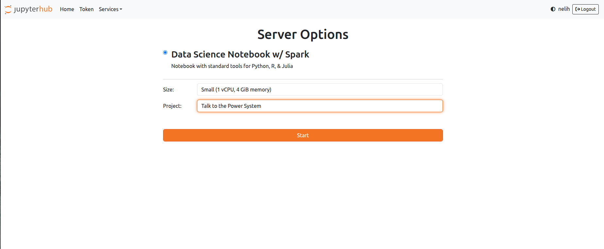
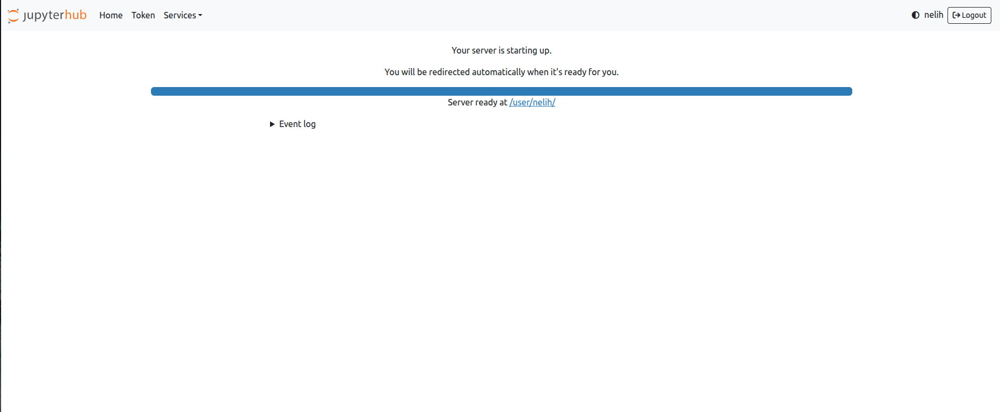
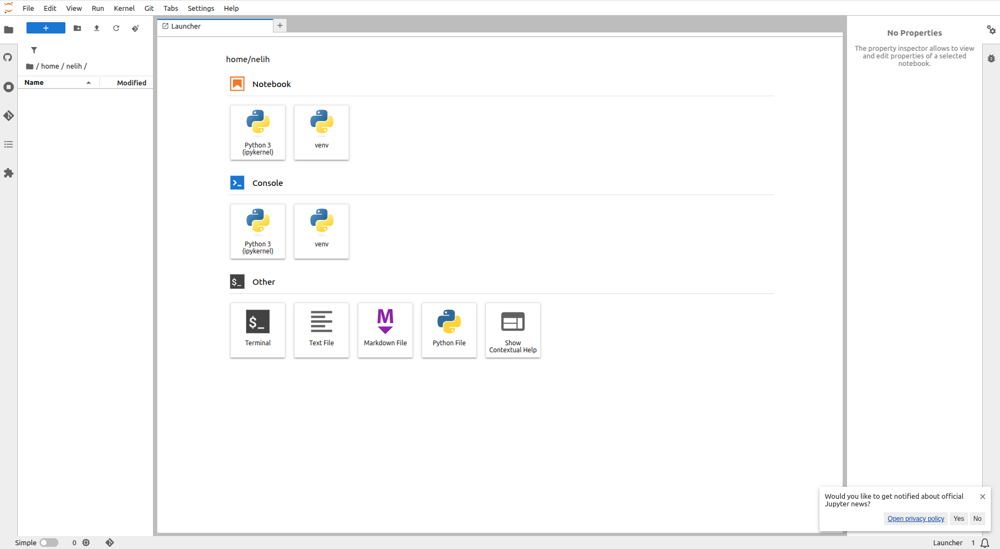
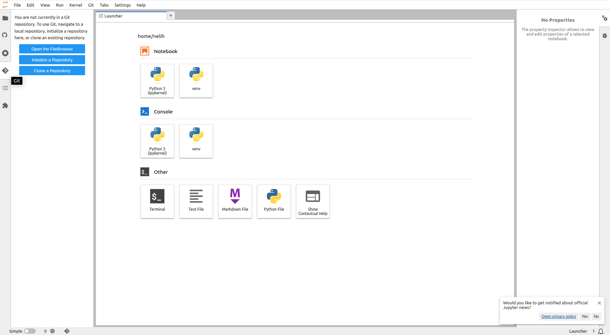
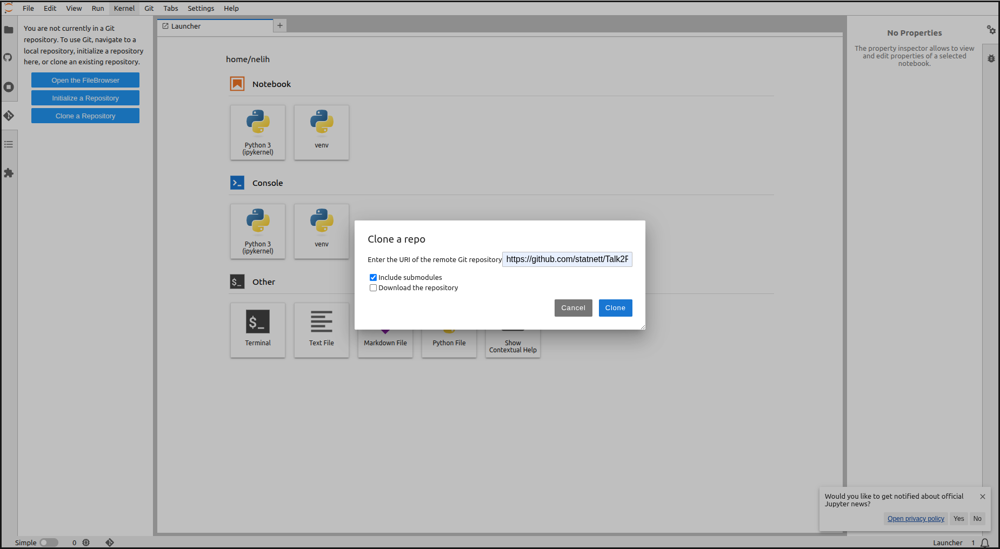
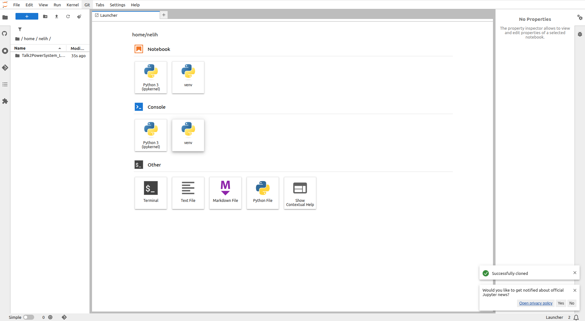
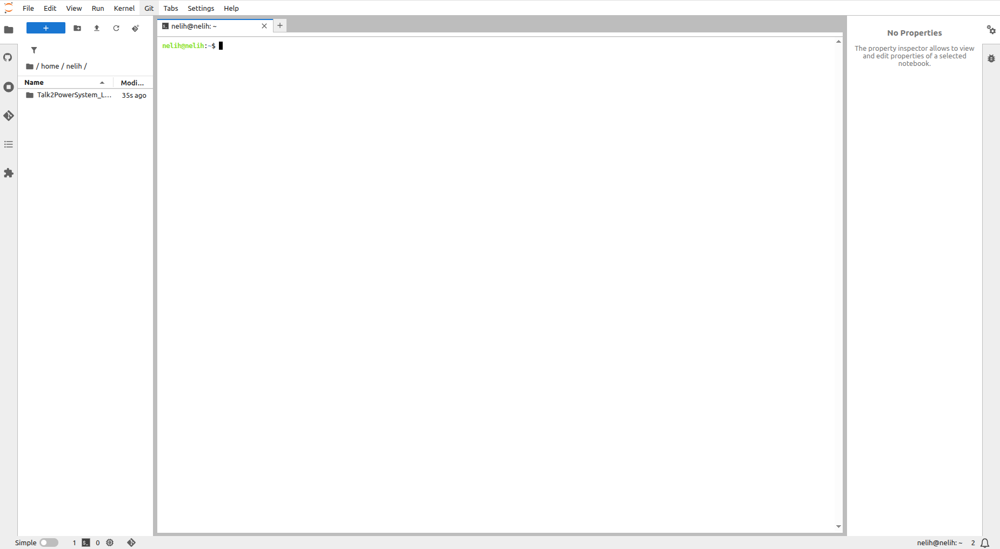
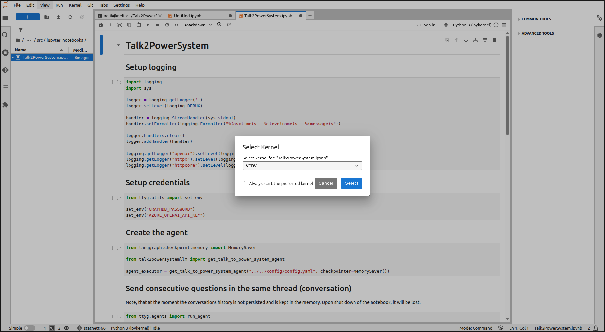

# Talk2PowerSystem Jupyter Notebook

## Run the chatbot on your developer machine using a Jupyter notebook

```bash
conda activate Talk2PowerSystemLLM
poetry install
jupyter notebook
```

The notebook will prompt you for Azure OpenAI credentials.
  - Azure OpenAI credentials are shared in Graphwise Keeper, entry `Statnett/Graphwise Azure Statnett Deployment GPT4.1`

## Run the chatbot on the RNDP environment using a Jupyter notebook

- Open https://rndp.statnett.no/ from your browser.
- Login with you Statnett Microsoft Account.
- A screen like this should appear:

- For size pickup `Small` and click `Start`
- It takes a while to start the server
 
- After that you should see a screen like this:

- From the left menu select git:

- Click the blue button `Clone a Repository`, enter https://github.com/statnett/Talk2PowerSystem_LLM for URI and click `Clone`:

- A folder named `Talk2PowerSystem_LLM` should appear under your home directory `/home/{your-user}`:

- From the `Launcher` tab section `Other` open a terminal
- A screen like this should appear:

- Check your working directory:
```commandline
pwd
```
It should be your home directory.
- Setup the environment:
  - Execute:
    ```commandline
    cd Talk2PowerSystem_LLM
    ```
  - Change the priority of the `statnett` mirroring repository from `supplemental` to `primary` using `nano` text editor:
    ```commandline
    nano pyproject.toml
    ```
  - Then:
    ```commandline
    poetry env use python3.12
    poetry lock
    poetry install
    source $(poetry env info --path)/bin/activate
    python -m ipykernel install --user --name=talk2powersystemllm-py3.12 --display-name "talk2powersystemllm-py3.12"
    ```
- From the file browser navigate to the notebook, it's under `src/jupyter_notebooks/Talk2PowerSystem.ipynb`.
- From the top right corner switch the kernel to `talk2powersystemllm-py3.12` from the dropdown and click `Select`:

- You should un-commend this
```
# set_env("GRAPHDB_PASSWORD")
```
- You should change this
```
agent_executor = Talk2PowerSystemAgent(
    Path("../../config/dev+cognite.yaml"),
    checkpointer=InMemorySaver()
).agent
```
to
```
agent_executor = Talk2PowerSystemAgent(
    Path("../../config/rndp.yaml"),
    checkpointer=InMemorySaver()
).agent
```
- Now you can run the notebook
- It will prompt you for the GraphDB and Azure OpenAI credentials.
  - Graphdb password can be obtained with:
```commandline
cat /srv/rndp/talk2powersystem/chatbot-user-graphdb-password
```
from the terminal. It's also shared in Graphwise Keeper, entry `Statnett/[RNDP] GraphDB chatbot user`
  - Azure OpenAI credentials can be obtained with:
```commandline
cat /srv/rndp/talk2powersystem/openai-api-key
```
from the terminal.
